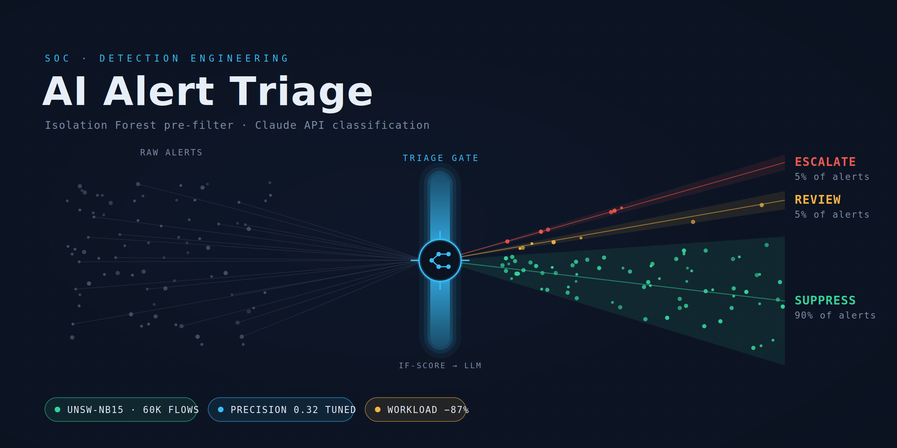

# AI Alert Triage

**A two-stage security-alert triage system that automatically suppresses false-positive noise so analysts only see the alerts that matter.** A cheap Isolation Forest pre-filter handles the obvious cases; the **Claude API** makes the judgement call on the ambiguous ones. Pulls alerts from a CSV or **live from a SIEM (Elasticsearch / Splunk)**.


Built as a portfolio project for SOC / GRC work — specifically *"automating false-positive analysis and reporting using AI."*

---

## Powered by the Claude API

The intelligence in this pipeline is **Anthropic's Claude API**. Stage 1 is a fast statistical filter that clears the easy cases, but the alerts in the ambiguous middle — the ones a human would have to stop and think about — are sent to Claude, which returns a structured verdict (`true_positive` / `false_positive` / `needs_review`), a confidence score, a one-line rationale, and a recommended action.

This is deliberate: running an LLM on *every* alert would be slow and costly, so the cheap pre-filter spends the Claude API budget only where human-level judgement is genuinely needed. That is what "AI triage" means here — using the model precisely, not indiscriminately.

> Model configurable via `TRIAGE_MODEL` in `.env` (default `claude-haiku-4-5` for cheap, high-volume triage; `claude-sonnet-4-6` for stronger per-alert reasoning).

## How it works

```
   data source (CSV / Elasticsearch / Splunk)
       │
       ▼
┌─────────────────────────────┐
│ STAGE 1  Isolation Forest    │   normalized anomaly score + rules
│ + rules (cheap, every alert) │
└─────────────────────────────┘
       │ routes each alert into one of three lanes
       ├─ auto_suppress  → likely false positive · no human, no LLM
       ├─ escalate       → clearly anomalous · straight to a ticket
       └─ review         → ambiguous … handed to Stage 2
                              │
                              ▼
              ┌─────────────────────────────┐
              │ STAGE 2  Claude API          │  verdict + confidence +
              │ (only the ambiguous alerts)  │  rationale + action, as JSON
              └─────────────────────────────┘
       │
       ▼
   metrics report · triaged table · ticket-ready JSON · dashboard
```

## Data sources

Switch sources from the dashboard sidebar, or call the connectors directly:

| Source | How | Notes |
|---|---|---|
| Synthetic sample | built in | labelled demo data, runs offline |
| CSV upload | dashboard / `run_pipeline("file.csv")` | your own data |
| **Elasticsearch** | `connectors/elastic.py` | live query against an index |
| **Splunk** | `connectors/splunk.py` | SPL search via the SDK |

The connectors map SIEM fields into the pipeline schema and are fully
configurable — point them at your own index/fields without editing code:

```python
from connectors.elastic import fetch_alerts
df = fetch_alerts(host="https://localhost:9200", index="unsw-nb15-*",
                  api_key="...", size=2000)
```

Defaults assume a UNSW-NB15-style index (as produced in the SRT411 Logstash
labs); override `FIELD_MAP` for a different schema. Unlabelled live data is
handled gracefully — operational metrics still compute, detection-quality
metrics are simply skipped.

## Dashboard

A themed Streamlit dashboard (`streamlit run app/dashboard.py`) with:
- a **source switcher** (synthetic / upload / Elasticsearch),
- metric cards, and
- tabbed Plotly charts that tell the triage story: decision breakdown,
  anomaly-score distribution with routing-threshold bands, a confusion-matrix
  heatmap, and an analyst-workload-removed view.

## Results — real data (UNSW-NB15)

On **60,000 real network flows** from the UNSW-NB15 intrusion dataset
(3.2% attacks), offline heuristic fallback, contamination tuned to 0.03:

| Metric | Value |
|---|---|
| Recall (threats caught) | 1.00 |
| Precision | 0.27–0.32 (threshold-dependent) |
| F1 | 0.42–0.48 |
| Analyst workload reduction | 0.87–0.90 |

A threshold sweep (`tools/tune_thresholds.py`) shows precision rising from
0.05 to 0.32 as the suppress threshold tightens, with recall holding at 1.0 —
suppression sheds benign noise without dropping attacks on this dataset.

> **Honest caveat:** UNSW-NB15's TTL features (`sttl`/`dttl`) are known to be
> highly discriminative for its synthetic attack traffic, which flatters
> recall. The defensible headline is the **precision/workload tradeoff**, not
> "perfect detection." Precision is also the metric the Claude API path is
> designed to lift further — the model removes false alarms the cheap filter
> can't.

## Quickstart

```bash
python -m venv venv && source venv/bin/activate
pip install -r requirements.txt

cp .env.example .env        # add your Anthropic key (optional; fallback otherwise)

python src/generate_sample_data.py
python -m src.pipeline       # CLI run
streamlit run app/dashboard.py   # dashboard
```

Get a key at the [Anthropic Console](https://console.anthropic.com). `.env` is
gitignored, so your key never reaches GitHub.

## Engineering extras

- **Tests + CI** — 23 pytest tests run on every push via GitHub Actions.
- **Automated analyst report** — every run writes `outputs/triage_report.md`
  (lane breakdown, detection quality, top escalations with rationales).
- **Ticketing REST push** — `connectors/ticket_push.py` creates real Jira
  issues or ServiceNow incidents from escalated alerts.
- **Explainability** — a `top_drivers` column shows which features pushed
  each alert from baseline (robust z-scores): the "why did this fire?" answer.
- **Config file** — thresholds/model/paths in `config.yaml`, not code.
- **Docker** — `docker build -t triage . && docker run -p 8501:8501 triage`.
- **Threshold tuning** — `tools/tune_thresholds.py` sweeps the suppress
  threshold and plots the precision/recall/workload tradeoff.

## Project layout

```
ai-alert-triage/
├── src/
│   ├── stage1_prefilter.py    Isolation Forest + routing rules
│   ├── stage2_classifier.py   Claude API classifier (+ offline fallback)
│   ├── pipeline.py            orchestration (CSV or DataFrame in)
│   ├── metrics.py             precision/recall/FP-suppression (+ unlabelled)
│   ├── viz.py                 Plotly charts
│   ├── theme.py               shared palette
│   └── generate_sample_data.py
├── connectors/
│   ├── elastic.py             Elasticsearch source
│   └── splunk.py              Splunk source
├── app/dashboard.py           themed Streamlit UI
├── .streamlit/config.toml     dark theme
└── outputs/                   generated reports (gitignored)
```

## Roadmap

- [x] Run on UNSW-NB15 and publish real precision / recall.
- [x] Threshold tuning analysis (`tools/tune_thresholds.py`).
- [x] Pull alerts live from Elasticsearch / Splunk.
- [x] Themed dashboard with source switching and story-telling charts.
- [x] Ticketing REST push (Jira / ServiceNow) via `connectors/ticket_push.py`.
- [ ] Run Stage 2 with a live API key on the full UNSW review band and publish the precision lift.

## Part of a portfolio

1. **ai-alert-triage** (this repo) — AI false-positive automation with the Claude API
2. **security-control-mapping** — NIST CSF 2.0 / ISO 27001 / PCI DSS mapping
3. **security-ticket-workflow** — ServiceNow / Jira incident workflow

---

<sub>This project uses the Claude API by Anthropic for AI-driven alert classification. Claude is a trademark of Anthropic.</sub>
